# 📊 Retail Analytics Project

## 📋 Overview

This project showcases a collection of SQL queries designed to perform **data-driven analysis** on retail business operations. It focuses on uncovering actionable insights related to customer purchasing behavior, store-level performance, staff contributions, and product trends. The goal is to support decision-making across sales, marketing, and operations using structured transactional data.

---

## 📈 Trends & Insights

- 🛒 **High-Value Customers**: A small segment of customers place frequent, high-spending orders—ideal for loyalty programs and retention strategies.
- 🧾 **Store Performance Gaps**: Some stores generate high sales with fewer orders, indicating higher AOV; others move high volume with low per-sale value.
- 👨‍💼 **Top Staff Members**: Specific staff handle more orders and unique customers, showing top performers who could be leveraged for training.
- 📦 **Product Popularity**: A few products dominate sales volume, useful for inventory planning and promotions.
- 💸 **Heavy Discounts**: Certain products consistently receive high discounts—potential margin risks or clearance trends.
- 📅 **Order Peaks**: Some months show significantly higher order counts, revealing seasonal demand or the impact of campaigns.

---

## 🧾 Query Catalog with Visual Insights

Each SQL file below corresponds to a specific business question or metric. Visuals provide a direct preview of analytical outcomes:

| **Query File** | **Purpose** | **Visualization Preview** |
|----------------|-------------|----------------------------|
| `avg_order_value_per_store.sql` | Calculates the average order value for each store location | 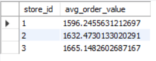 |
| `avg_product_per_cust.sql` | Determines average number of products per customer | 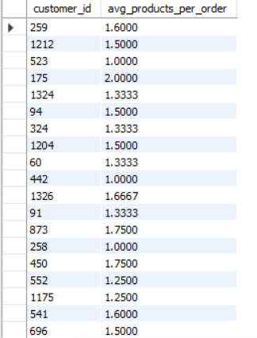 |
| `Higest_avg_discount.sql` | Finds products with the highest average discount rates | 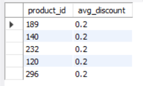 |
| `Higest_order.sql` | Retrieves highest value orders | 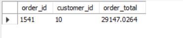 |
| `order_count.sql` | Shows monthly order trends | 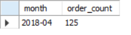 |
| `order_per_cust.sql` | Analyzes frequency of customer purchases | 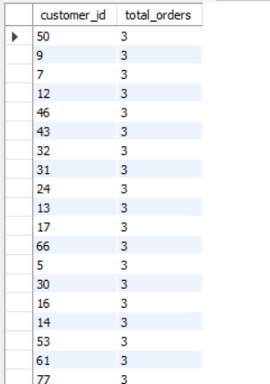 |
| `revenue_per_Customer.sql` | Calculates total revenue per customer | 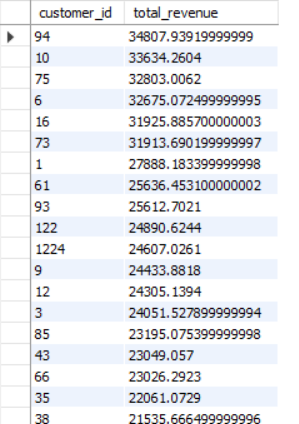 |
| `revenue_per_staff.sql` | Measures revenue generated by staff members | 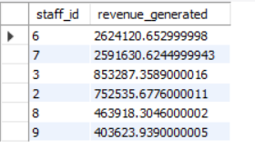 |
| `Spent_analysis.sql` | Performs customer spending pattern analysis | 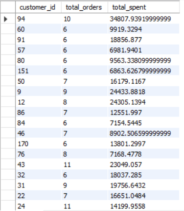 |
| `Staff_handel.sql` | Evaluates order handling performance by staff | 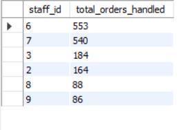 |
| `top_Staff.sql` | Identifies top performing staff based on orders | 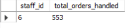 |
| `total_no_item_Sold.sql` | Counts total unique items sold | 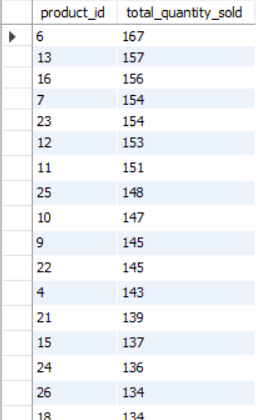 |
| `total_quantity.sql` | Aggregates total quantity sold | 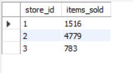 |
| `totalSales_totalDiscount.sql` | Compares total sales and total discounts | 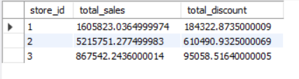 |
| `unique_cust_per_staff.sql` | Tracks how many unique customers each staff served |  |

---

## 🧩 Database Schema

These queries work with a retail database schema that includes the following key tables:

- `orders` – Contains order header information  
- `order_items` – Contains line item details for each order  
- `customers` – Customer information  
- `staff` – Staff member details  
- `stores` – Store location information  
- `products` – Product catalog data  

---

*© 2025 Parle Data Analytics*
